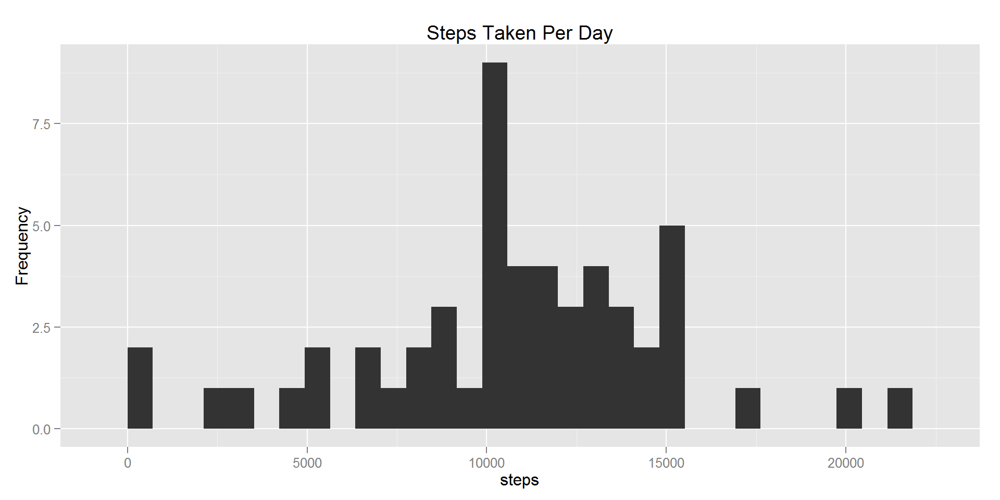
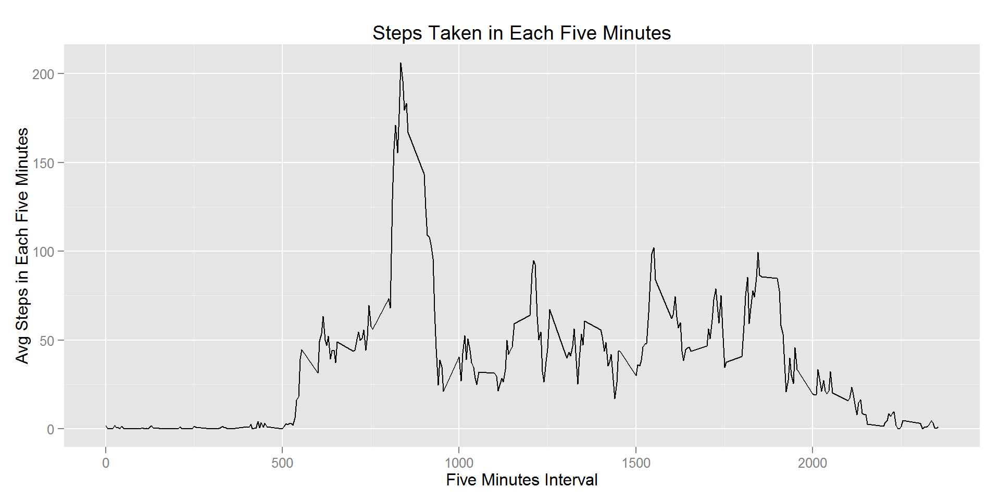
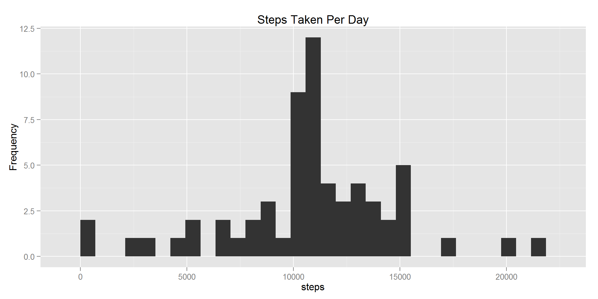
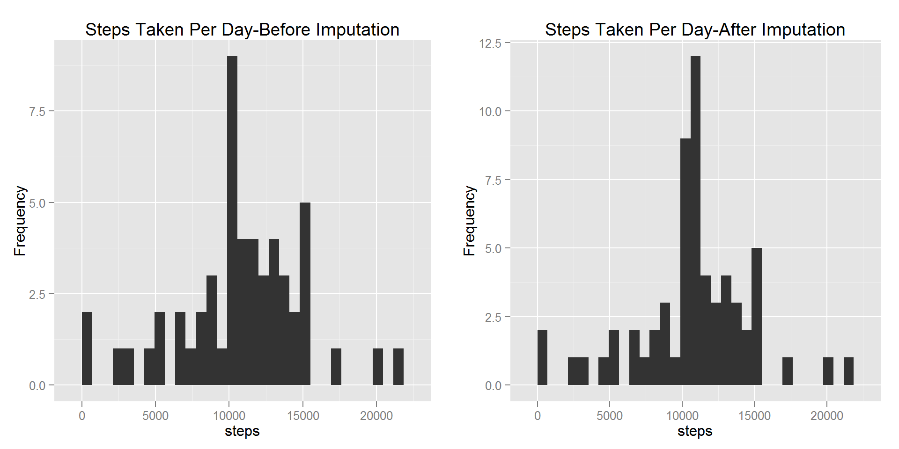
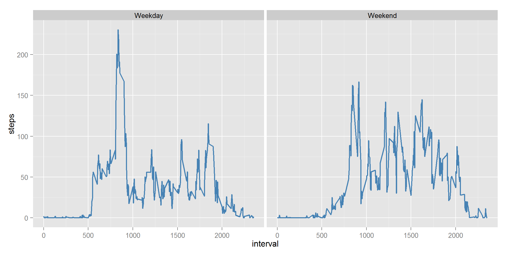

### Setting Global Options

```r
library(knitr)
library(ggplot2)
library(grid)
library(gridExtra)
opts_chunk$set(echo=TRUE, fig.path="figures/",fig.width=10,fig.align="center")
library(hash)
```

###Introduction
With the availability of activity monitoring devices such as [Fitbit][1], [Jawbone][3] or the coming [Apple Watch][3], people's activity patterns can be tracked and analyzed. 

[1]: http://www.fitbit.com/ "Fitbit"
[2]: https://jawbone.com/up "Jawbone"
[3]: http://www.apple.com/watch/?cid=wwa-us-kwg-watch-com "Apple Watch"

In this peer assessment project,we are provided with a raw dataset collected by such devices at 5 minutes interval throughout a two-month time period. The learning objectives include:

* Mean total number of steps taken per day 
* Average daily activity pattern 
* Re-calculate mean total number of steps taken per day by imputing the missing values
* Identifying the differences in activity patterns between weekdays and weekends

###Data Processing 
Here, we're going to load the activity monitoring data.

```r
unzip("./activity.zip",exdir = ".")
activity<-read.csv("./activity.csv")
#remove the missing values
activity_new<-activity[complete.cases(activity),]
```


### Mean Total Number of Steps Taken per Day
Summarize the total steps taken on each day and make a histogram

```r
daily_step<-aggregate( steps ~ date, data=activity_new, FUN=sum)
qplot(steps,data=daily_step,geom="histogram",main="Steps Taken Per Day",
      ylab="Frequency")
```

```
## stat_bin: binwidth defaulted to range/30. Use 'binwidth = x' to adjust this.
```



```r
mean_steps<-mean(daily_step$steps)
median_steps<-median(daily_step$steps)
```

If we exclude all the **NA** values, the mean of total steps taken per day is calculated as **1.0766 &times; 10<sup>4</sup>**.  The median of total steps taken per day is **10765**.


### Average Daily Activity Pattern 
Average the steps based on intervals, i.e steps taken in each five minutes

```r
interval_step<-aggregate( steps ~ interval, data=activity_new, FUN="mean")
qplot(interval,steps, data=interval_step,geom="line",
      main="Steps Taken in Each Five Minutes", 
      xlab="Five Minutes Interval", ylab="Avg Steps in Each Five Minutes")     
```




Find the interval with maximum steps across all the  days

```r
maximum_step<-max(interval_step$steps)
for (i in 1:nrow(interval_step)){
  if (interval_step[i,2]==maximum_step){
    maximum_interval<-interval_step[i,1]    
  }
}
```
The 5-minute interval with maximum steps (206.1698) is 835


### Imputing Missing Values
Calculate the total number of missing values in the dataset

```r
missing_number<-nrow(activity)-nrow(activity_new)
```
The total number of rows with NAs is **2304**

Create a new dataset with filled missing values. 
Here, I use the mean of the steps taken in 5-minutes intervals as the replacement for the missing data. 

```r
activity_fill<-activity
h<-hash(keys=interval_step$interval,values=interval_step$steps)
for (i in 1:nrow(activity_fill)){  
  if (is.na(activity_fill[i,1])){
    hash_key<-as.character(activity_fill[i,3])
    activity_fill[i,1]<-as.numeric(h[[hash_key]])   
  }
}
```

Then, make a histogram of the total number of steps taken each day with filled values

```r
daily_step_fill<-aggregate( steps ~ date, data=activity_fill, FUN=sum)
qplot(steps,data=daily_step_fill,geom="histogram",main="Steps Taken Per Day",ylab="Frequency")
```

```
## stat_bin: binwidth defaulted to range/30. Use 'binwidth = x' to adjust this.
```




Calculate the new mean and new median of the total steps

```r
mean_steps_filled<-mean(daily_step_fill$steps)
median_steps_filled<-median(daily_step_fill$steps)
p1<-qplot(steps,data=daily_step,geom="histogram",main="Steps Taken Per Day-Before Imputation",
          ylab="Frequency")
p2<-qplot(steps,data=daily_step_fill,geom="histogram",main="Steps Taken Per Day-After Imputation",
          ylab="Frequency")
grid.arrange(p1, p2,ncol=2)
```

```
## stat_bin: binwidth defaulted to range/30. Use 'binwidth = x' to adjust this.
## stat_bin: binwidth defaulted to range/30. Use 'binwidth = x' to adjust this.
```




The new mean of total steps taken per day is **1.0766 &times; 10<sup>4</sup>**.  The new median of total steps taken per day is **1.0766 &times; 10<sup>4</sup>**. Compare the histogram side by side, it seems that the imputation doesn't impact the mean and median values much (only **1 step** increase in median value) and the general distribution shape has been preserved. However, after the imputation, since the missing dates have been filled with averaged value and the **variance of the total daily steps has been reduced**. 


### Activity Patterns in Weekdays and Weekends

First, create a new factor variable in the dataset indicating whether a given date is a weekday or weekend day

```r
activity_fill$date<-as.Date(activity_fill$date)
for(i in 1:nrow(activity_fill)){
  if((weekdays(activity_fill[i,2])=="Saturday")||(weekdays(activity_fill[i,2])=="Sunday")){
    activity_fill[i,4]="Weekend"
  } else {
    activity_fill[i,4]="Weekday"    
  }
}
colnames(activity_fill)[4]<-"week"
activity_fill$week<-as.factor(activity_fill$week)
head(activity_fill,3)
```

```
##    steps       date interval    week
## 1 1.7170 2012-10-01        0 Weekday
## 2 0.3396 2012-10-01        5 Weekday
## 3 0.1321 2012-10-01       10 Weekday
```

Make a panel plot containing a time series plot of the 5-minute interval (x-axis) and the average number of steps taken, averaged across all weekday days or weekend days (y-axis)

```r
interval_step_week<-aggregate( steps ~ interval+week, data=activity_fill, FUN="mean")
g<-ggplot(interval_step_week,aes(interval,steps))
g+geom_line(color="steelblue",size=0.75)+facet_grid(.~week)
```



Based on the panel plot, it can be inferred that this person is generally taking more steps in weekdays than in weekends, especially around 10:00am in the morning. However, his or her activities are more evenly distributed in weekend, indicating he or she may participat in more kinds of activities in weekend.
